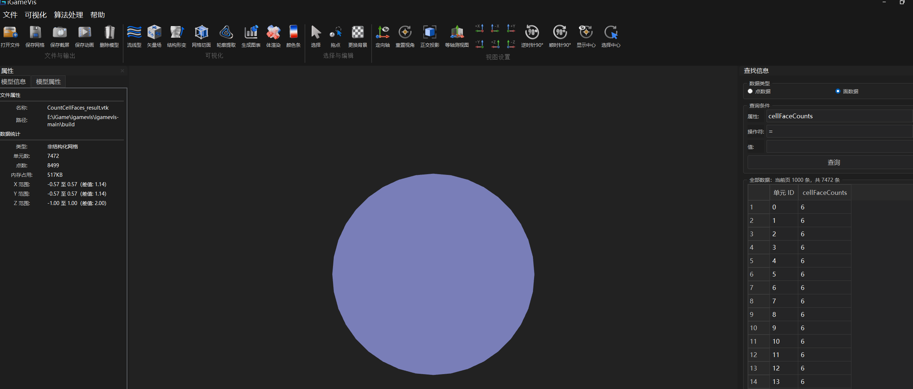
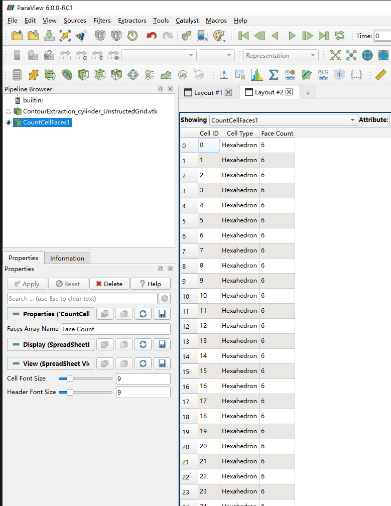

# Count Cell Faces

## Overview

`Count Cell Faces` counts the number of faces for every cell in a mesh and
generates the cell attribute:

```text
cellFaceCounts
```

## Algorithm

| Cell type | Face count |
| --- | ---: |
| Tetrahedron | 4 |
| Hexahedron | 6 |
| Pyramid | 5 |
| Prism / wedge | 5 |
| Polyhedron | Calculated from its face connectivity |
| Vertex, line, triangle, quadrilateral and other lower-dimensional cells | 0 |

Quadratic and Lagrange cells use the topology of their corresponding base
cell. For example, a quadratic tetrahedron has 4 faces and a Lagrange
hexahedron has 6 faces.

## Supported meshes

| Mesh type | Support |
| --- | --- |
| `UnstructuredMesh` | Fixed-topology, mixed, high-order and valid polyhedron cells |
| `LagrangeUnstructuredMesh` | Recognized Lagrange curve, surface and volume cells |
| `VolumeMesh` | Tetrahedron, pyramid, prism and hexahedron cells |
| 3D `StructuredMesh` | Each volume cell has 6 faces |
| 2D `StructuredMesh` | Each cell receives 0 |
| `SurfaceMesh` | Each surface cell receives 0 |

Unsupported cell types receive 0 and are reported in the log. Unsupported
data-object types cause the filter to return `false` without performing the
calculation.

## Example

Source:

```text
Examples/Filter/FeatureExtraction/CountCellFaces.cpp
```

Usage:

```text
testCountCellFaces <input-model>
```

The example prints the attribute name, number of cells and the face count of
each cell to the terminal.

## Validation

The same model was processed in iGameVis and ParaView. The resulting cell-face
counts are consistent.

### iGameVis result



### ParaView reference



## Logging

The filter logs missing input, unsupported mesh or cell types, invalid
connectivity and successful completion. Runtime logs are written to:

```text
logs/iGame-core-log.txt
```
