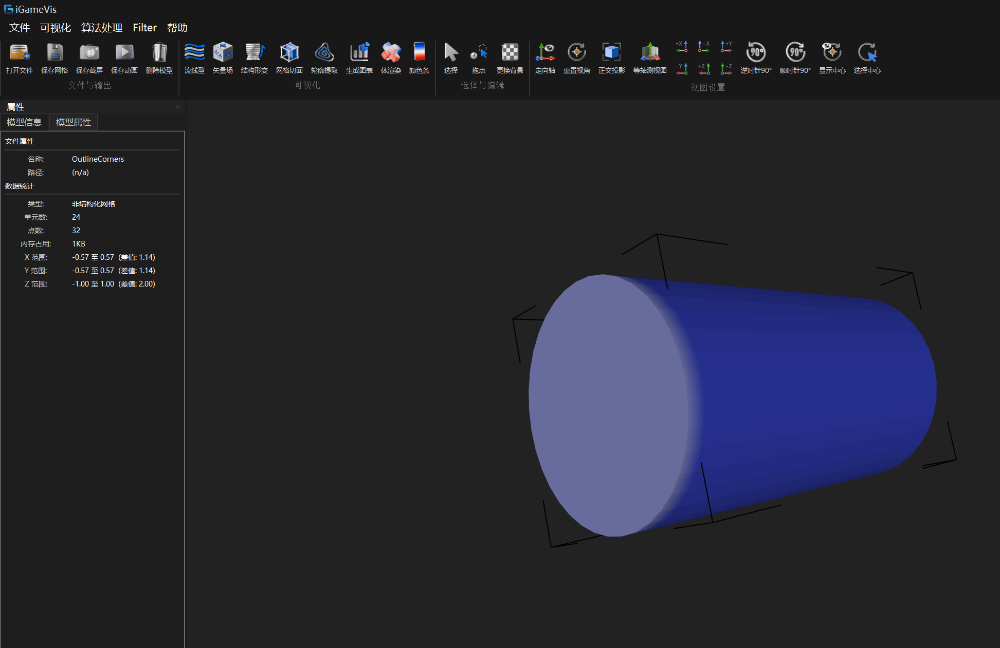
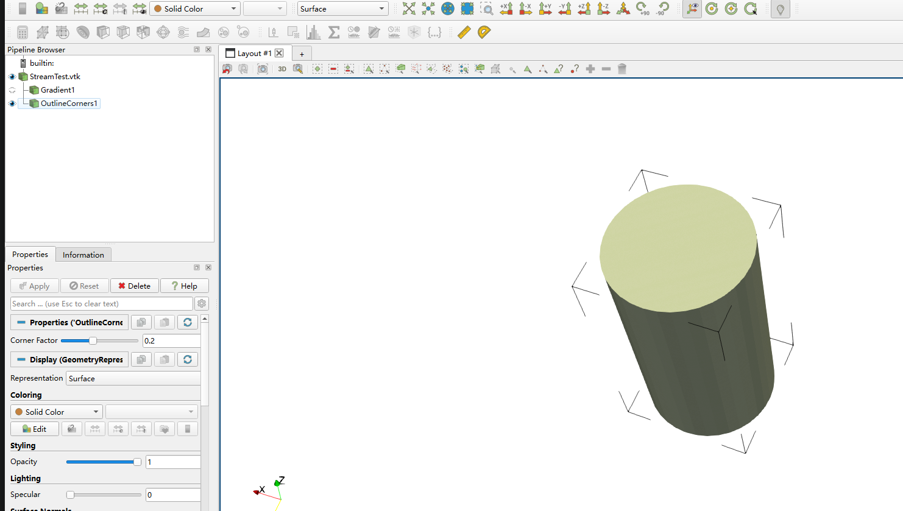

# Outline Corners

## Overview

`Outline Corners` generates eight corner markers from the spatial bounding box
of a model. The markers help show the model extent without replacing or
modifying the input geometry.

## Result

Each bounding-box corner contains three short line segments aligned with the
X, Y and Z axes. The output contains:

- 8 corner markers;
- 24 line cells;
- 32 points.

The line length is controlled by `CornerFactor`:

- default: `0.2`;
- valid range: `0.001` to `0.5`;
- the value is relative to the bounding-box length of each axis.

## Supported data

The filter does not depend on a specific mesh cell type. Any data object with
a valid finite bounding box is supported. Missing input, invalid bounds and
non-finite coordinates are reported in the log and cause `Execute()` to
return `false`.

## iGameVis

After loading and selecting a model, run:

```text
算法处理 -> 特征提取 -> 提取包围盒角点 (Outline Corners)
```

The generated `OutlineCorners` result is added to the model tree and rendered
as lines.

## Example

Source:

```text
Examples/Filter/FeatureExtraction/OutlineCorners.cpp
```

Usage:

```text
testOutlineCorners <input-model> [corner-factor]
```

The example prints the corner factor, output point count, line-cell count and
the eight corner coordinates.

## Validation

The same model was processed in iGameVis and ParaView. Both results contain
corner markers at the eight bounding-box corners.

### iGameVis result



### ParaView reference



## Logging

Runtime messages are written with the project logging macros. The log file is:

```text
logs/iGame-core-log.txt
```
